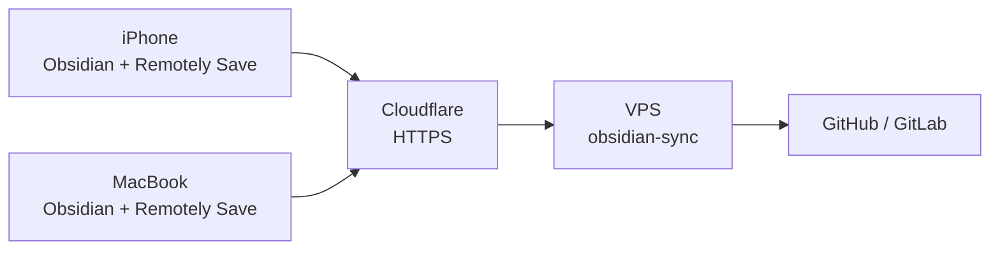

# obsidian-git-sync

[](https://go.dev)
[](LICENSE)
[](https://github.com/0xa1bed0/obsidian-git-sync/actions/workflows/release.yml)
[](https://ghcr.io/0xa1bed0/obsidian-git-sync)

S3-compatible server for Obsidian's [Remotely Save](https://github.com/remotely-save/remotely-save) plugin with built-in git auto-commit and push.

## Features

- Implements just enough S3 API for Remotely Save (`PutObject`, `GetObject`, `DeleteObject`, `HeadObject`, `ListObjectsV2`)
- Authenticates requests using AWS Signature V4
- Stores files as plain files on disk — your vault is just a directory
- On any PUT or DELETE, triggers a debounced git commit + push via HTTPS
- Single static binary (~6 MB), no runtime dependencies
- Built-in [go-git](https://github.com/go-git/go-git) — no system `git` required

## Architecture



## Quick start

### Option A: Docker Compose (recommended)

```bash
mkdir -p /opt/obsidian-sync/vault
cd /opt/obsidian-sync
```

Create `docker-compose.yml`:

```yaml
services:
  obsidian-sync:
    image: ghcr.io/0xa1bed0/obsidian-git-sync:latest
    container_name: obsidian-sync
    restart: unless-stopped
    ports:
      - "80:80"
    volumes:
      - ./vault:/vault
    environment:
      - ACCESS_KEY=your-access-key
      - SECRET_KEY=your-secret-key
      - BUCKET=vault
      - REGION=us-east-1
      - GIT_REPO=https://github.com/you/obsidian-vault.git
      - GIT_TOKEN=ghp_your-personal-access-token
      - GIT_BRANCH=main
      - DEBOUNCE=10
```

```bash
docker compose up -d
docker logs -f obsidian-sync
```

### Option B: Build from source

```bash
git clone https://github.com/0xa1bed0/obsidian-git-sync.git
cd obsidian-sync
go build -o obsidian-sync .
./obsidian-sync \
  -access-key your-key \
  -secret-key your-secret \
  -git-repo https://github.com/you/obsidian-vault.git \
  -git-token ghp_your-token
```

## Configuration

| Variable | Default | Description |
|----------|---------|-------------|
| `VAULT_DIR` | `/vault` | Directory to store vault files |
| `BUCKET` | `vault` | S3 bucket name |
| `ADDR` | `:80` | Listen address |
| `ACCESS_KEY` | _(none)_ | S3 access key (no auth if empty) |
| `SECRET_KEY` | _(none)_ | S3 secret key |
| `REGION` | `us-east-1` | AWS region for SigV4 |
| `GIT_REPO` | _(none)_ | Git remote HTTPS URL (no push if empty) |
| `GIT_TOKEN` | _(none)_ | Personal access token for HTTPS git auth |
| `GIT_BRANCH` | `main` | Git branch |
| `GIT_USER` | `Obsidian Sync` | Git commit author name |
| `GIT_EMAIL` | `obsidian@sync` | Git commit author email |
| `DEBOUNCE` | `10` | Seconds to debounce before git commit |
| `PULL_INTERVAL` | `60` | Seconds between periodic git pulls (0 to disable) |

All variables can also be passed as CLI flags (e.g. `-access-key`, `-git-token`).

### Creating a GitHub token

1. Go to [Fine-grained tokens](https://github.com/settings/personal-access-tokens/new)
2. **Token name** — e.g. `obsidian-sync`
3. **Expiration** — pick what you're comfortable with
4. **Repository access** — "Only select repositories" → pick your vault repo
5. **Permissions → Repository permissions** — set **Contents** to **Read and write**
6. Click **Generate token** and copy the value (`github_pat_...`)
7. Set it as `GIT_TOKEN` in your `docker-compose.yml`

## Remotely Save setup

1. Obsidian → Settings → Community plugins → Install **Remotely Save**
2. Settings → Remotely Save:
   - Remote service: **S3 or S3-compatible**
   - Endpoint: `https://sync.yourdomain.com`
   - Region: `us-east-1`
   - Access Key ID: your access key
   - Secret Access Key: your secret key
   - Bucket: `vault`
   - **Check** "S3 path style" / Force Path Style
   - **Disable** "S3 metadata sync" (CopyObject is not implemented)
3. Click **Check Connectivity**
4. Set auto-sync interval (e.g. 5 minutes)

Repeat on every device.

## S3 API coverage

| Operation | Supported | Notes |
|-----------|-----------|-------|
| PutObject | Yes | Triggers git sync |
| GetObject | Yes | |
| HeadObject | Yes | |
| DeleteObject | Yes | Triggers git sync, cleans empty dirs |
| ListObjectsV2 | Yes | Skips `.git` directory |
| HeadBucket | Yes | |
| CopyObject | No | Not needed by Remotely Save |
| Multipart Upload | No | Not needed for typical vault files |

## Contributing

1. Fork the repo
2. Create a feature branch
3. Run `go test ./...` and `go vet ./...`
4. Open a pull request

## License

[Elastic License 2.0 (ELv2)](LICENSE) — Copyright 2025 Albedo Technologies SRL.

You may use, modify, and redistribute this software. You may **not** provide it as a hosted/managed service. See `LICENSE` for full terms.
