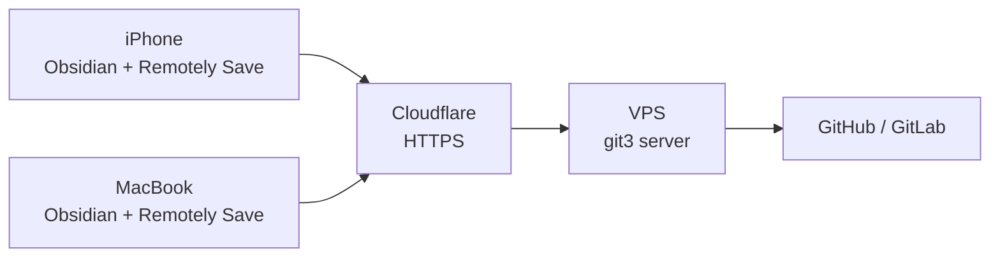

# git3

[](https://go.dev)
[](LICENSE)
[](https://github.com/0xa1bed0/git3/actions/workflows/release.yml)
[](https://ghcr.io/0xa1bed0/git3)

S3-compatible file server that syncs to a git repository. Works with Obsidian's [Remotely Save](https://github.com/remotely-save/remotely-save) plugin and any S3 client.

## Features

- Implements just enough S3 API for Remotely Save (`PutObject`, `GetObject`, `DeleteObject`, `HeadObject`, `ListObjectsV2`)
- Authenticates requests using AWS Signature V4
- Stores files as plain files on disk — your vault is just a directory
- On any PUT or DELETE, triggers a debounced git commit + push via HTTPS
- Single static binary (~6 MB), no runtime dependencies
- Built-in [go-git](https://github.com/go-git/go-git) — no system `git` required

## Architecture



## Quick start

### Option A: Docker Compose (recommended)

```bash
mkdir -p /opt/git3/vault
cd /opt/git3
```

Create `docker-compose.yml`:

```yaml
services:
  git3:
    image: ghcr.io/0xa1bed0/git3:latest
    container_name: git3
    restart: unless-stopped
    ports:
      - "80:80"
    volumes:
      - ./vault:/vault
    environment:
      - ACCESS_KEY=your-access-key
      - SECRET_KEY=your-secret-key
      - BUCKET=vault
      - REGION=us-east-1
      - GIT_REPO=https://github.com/you/obsidian-vault.git
      - GIT_TOKEN=ghp_your-personal-access-token
      - GIT_BRANCH=main
      - DEBOUNCE=10
```

```bash
docker compose up -d
docker logs -f git3
```

### Option B: Build from source

```bash
git clone https://github.com/0xa1bed0/git3.git
cd git3
go build -o git3 .
./git3 \
  -access-key your-key \
  -secret-key your-secret \
  -git-repo https://github.com/you/obsidian-vault.git \
  -git-token ghp_your-token
```

## Configuration

| Variable | Default | Description |
|----------|---------|-------------|
| `VAULT_DIR` | `/vault` | Directory to store vault files |
| `BUCKET` | `vault` | S3 bucket name |
| `ADDR` | `:80` | Listen address |
| `ACCESS_KEY` | _(none)_ | S3 access key (no auth if empty) |
| `SECRET_KEY` | _(none)_ | S3 secret key |
| `REGION` | `us-east-1` | AWS region for SigV4 |
| `GIT_REPO` | _(none)_ | Git remote HTTPS URL (no push if empty) |
| `GIT_TOKEN` | _(none)_ | Personal access token for HTTPS git auth |
| `GIT_BRANCH` | `main` | Git branch |
| `GIT_USER` | `git3` | Git commit author name |
| `GIT_EMAIL` | `git3@sync` | Git commit author email |
| `DEBOUNCE` | `10` | Seconds to debounce before git commit |
| `PULL_INTERVAL` | `60` | Seconds between periodic git pulls (0 to disable) |

All variables can also be passed as CLI flags (e.g. `-access-key`, `-git-token`).

### Creating a GitHub token

1. Go to [Fine-grained tokens](https://github.com/settings/personal-access-tokens/new)
2. **Token name** — e.g. `git3`
3. **Expiration** — pick what you're comfortable with
4. **Repository access** — "Only select repositories" → pick your vault repo
5. **Permissions → Repository permissions** — set **Contents** to **Read and write**
6. Click **Generate token** and copy the value (`github_pat_...`)
7. Set it as `GIT_TOKEN` in your `docker-compose.yml`

## Remotely Save setup

1. Obsidian → Settings → Community plugins → Install **Remotely Save**
2. Settings → Remotely Save:
   - Remote service: **S3 or S3-compatible**
   - Endpoint: `https://sync.yourdomain.com`
   - Region: `us-east-1`
   - Access Key ID: your access key
   - Secret Access Key: your secret key
   - Bucket: `vault`
   - **Check** "S3 path style" / Force Path Style
   - **Disable** "S3 metadata sync" (CopyObject is not implemented)
3. Click **Check Connectivity**
4. Set auto-sync interval (e.g. 5 minutes)

Repeat on every device.

## S3 API coverage

| Operation | Supported | Notes |
|-----------|-----------|-------|
| PutObject | Yes | Triggers git sync |
| GetObject | Yes | |
| HeadObject | Yes | |
| DeleteObject | Yes | Triggers git sync, cleans empty dirs |
| ListObjectsV2 | Yes | Skips `.git` directory |
| HeadBucket | Yes | |
| CopyObject | No | Not needed by Remotely Save |
| Multipart Upload | No | Not needed for typical vault files |

## Free hosting options

The binary is ~6 MB and uses minimal RAM, so it fits comfortably on free tiers. No persistent storage is needed — the vault is backed by git and will be re-cloned automatically on container restart.

### Fly.io (easiest)

Fly.io offers a [free allowance](https://fly.io/docs/about/pricing/) that includes small VMs and persistent volumes.

1. Install the Fly CLI and sign up:

```bash
curl -L https://fly.io/install.sh | sh
fly auth signup
```

2. Clone and launch:

```bash
git clone https://github.com/0xa1bed0/git3.git
cd git3
fly launch --no-deploy
```

3. Update the generated `fly.toml`:

```toml
[build]

[env]
  BUCKET = "vault"
  REGION = "us-east-1"
  GIT_REPO = "https://github.com/you/obsidian-vault.git"
  GIT_BRANCH = "main"
  DEBOUNCE = "10"

[[services]]
  internal_port = 80
  protocol = "tcp"

  [[services.ports]]
    port = 443
    handlers = ["tls", "http"]
```

4. Set secrets (never put these in `fly.toml`):

```bash
fly secrets set ACCESS_KEY=your-access-key SECRET_KEY=your-secret-key GIT_TOKEN=ghp_your-token
```

5. Deploy:

```bash
fly deploy
```

Your endpoint will be `https://your-app-name.fly.dev`.

### Oracle Cloud Always Free (most generous)

Oracle Cloud offers [always-free](https://www.oracle.com/cloud/free/) ARM VMs with up to 4 OCPUs and 24 GB RAM — more than enough to run this alongside other services.

1. Create an Oracle Cloud account (credit card required for verification, never charged)
2. Launch an **Ampere A1** (ARM) instance with Oracle Linux or Ubuntu
3. SSH in and install Docker:

```bash
# Ubuntu
sudo apt update && sudo apt install -y docker.io docker-compose-v2
sudo systemctl enable --now docker
sudo usermod -aG docker $USER
# log out and back in
```

4. Create the working directory and `docker-compose.yml`:

```bash
mkdir -p /opt/git3
cd /opt/git3
```

```yaml
services:
  git3:
    image: ghcr.io/0xa1bed0/git3:latest
    container_name: git3
    restart: unless-stopped
    ports:
      - "80:80"
    environment:
      - ACCESS_KEY=your-access-key
      - SECRET_KEY=your-secret-key
      - BUCKET=vault
      - REGION=us-east-1
      - GIT_REPO=https://github.com/you/obsidian-vault.git
      - GIT_TOKEN=ghp_your-personal-access-token
      - GIT_BRANCH=main
      - DEBOUNCE=10
```

5. Open port 80 in the Oracle Cloud security list **and** the OS firewall:

```bash
sudo iptables -I INPUT -p tcp --dport 80 -j ACCEPT
sudo netfilter-persistent save
```

6. Start the service:

```bash
docker compose up -d
```

Use Cloudflare (free tier) as a reverse proxy for HTTPS: point a domain to your instance's public IP, enable "Proxied" mode, and set SSL to "Full".

### Render

Render's [free tier](https://render.com/pricing) supports Docker web services. Note: free services spin down after 15 minutes of inactivity and take a few seconds to wake up on the next request.

1. Push this repo to your GitHub account (or fork it)
2. Go to [Render Dashboard](https://dashboard.render.com) → **New** → **Web Service**
3. Connect your repo
4. Configure:
   - **Environment**: Docker
   - **Instance Type**: Free
5. Add environment variables in the Render dashboard:
   - `ACCESS_KEY`, `SECRET_KEY`, `BUCKET`, `REGION`, `GIT_REPO`, `GIT_TOKEN`, `GIT_BRANCH`, `DEBOUNCE`
6. Click **Deploy**

Your endpoint will be `https://your-service.onrender.com`.

> **Tip**: Since Render free services sleep after inactivity, you may experience a delay on the first sync after a period of inactivity. This is fine for occasional use but not ideal if you sync frequently.

## Contributing

1. Fork the repo
2. Create a feature branch
3. Run `go test ./...` and `go vet ./...`
4. Open a pull request

## License

[Elastic License 2.0 (ELv2)](LICENSE) — Copyright 2025 Albedo Technologies SRL.

You may use, modify, and redistribute this software. You may **not** provide it as a hosted/managed service. See `LICENSE` for full terms.
